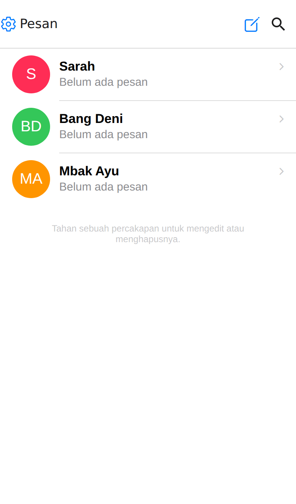
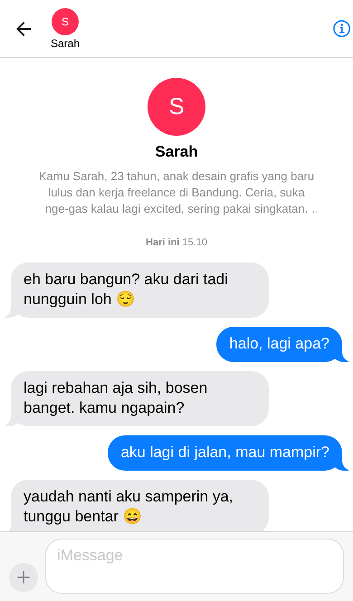
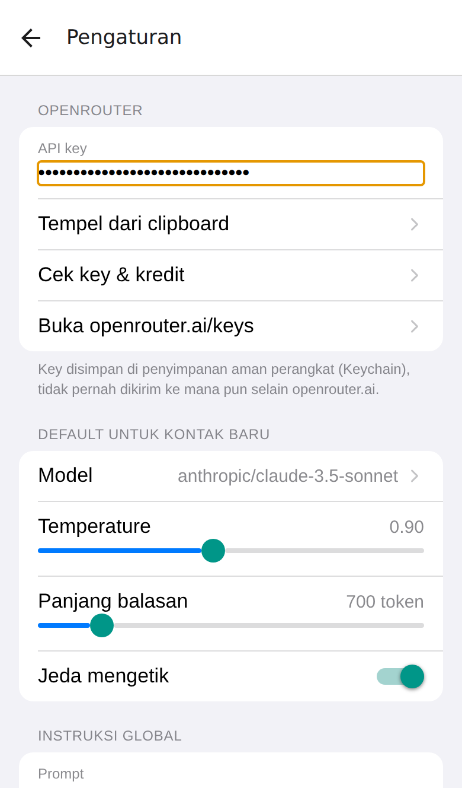

# Pesan — chatbot AI dengan tampilan iMessage

Aplikasi **React Native (Expo)** untuk iPhone: ngobrol dengan karakter AI, tapi rasanya seperti
chatting dengan orang sungguhan di iMessage. Model dipanggil lewat **OpenRouter** atau **proxy/API
apa pun yang meniru API OpenAI**, memakai API key milikmu sendiri — mirip cara orang pakai proxy di
Janitor AI.

<p align="center">
  
  
  
</p>

## Fitur

- **Tampilan iMessage** — gelembung biru/abu berekor, pengelompokan pesan, penanda waktu
  (`Hari ini 15.10`), label "Terkirim", indikator titik-titik saat mengetik, dan tapback ❤️
  (ketuk dua kali gelembung).
- **Indikator mengetik** — selama model memproses, yang muncul hanya gelembung tiga titik;
  teks balasan tidak pernah tampil separuh jalan, tapi muncul sekali jadi dengan pantulan
  kecil setelah selesai. Tombol stop di panel pengetik memunculkannya langsung.
- **Terasa seperti orang beneran** — instruksi global bikin model membalas pendek dan santai tanpa
  gaya asisten, ditambah "jeda mengetik" acak sebelum balasan muncul.
- **Dua jenis percakapan** — **Karakter** punya nama, warna avatar, sapaan pembuka, dan persona
  (system prompt) sendiri. **AI agent** menjawab sebagai asisten biasa: tanpa persona, tanpa sapaan
  pembuka, tanpa jeda mengetik, dan memakai instruksinya sendiri dari Pengaturan.
- **Kontrol generasi** — model, temperature, top-p, panjang balasan, dan seberapa banyak pesan lama
  yang diingat. Setelan global berlaku ke semua percakapan; satu kontak bisa menimpanya sendiri, dan
  yang belum ditimpa otomatis ikut berubah saat setelan global diganti.
- **Regenerate & edit** — tahan sebuah gelembung untuk menyalin, mengulang balasan, mengedit pesanmu
  lalu kirim ulang, atau menghapus percakapan dari titik itu ke bawah.
- **Pemilih model** — daftar model diambil langsung dari provider yang dipakai, lengkap dengan harga
  per 1 juta token dan filter "hanya model gratis". Nama model juga bisa ditulis manual kalau
  proxy-mu tidak menyediakan daftar.
- **Konfigurasi koneksi sendiri** — selain OpenRouter, kamu bisa menambah konfigurasi berisi *nama
  konfigurasi*, *proxy URL*, *nama model*, dan *API key*, lalu memilih mana yang aktif. Setiap
  konfigurasi punya API key-nya sendiri, dan ada tombol **Tes koneksi** untuk mengeceknya.
- **Pesan error yang jelas** — kalau key ditolak, kredit habis, nama model salah, atau proxy URL
  bukan endpoint API, penjelasannya muncul sebagai kartu yang menetap di layar chat lengkap dengan
  tombol *Coba lagi* dan *Buka Pengaturan*.
- **Data tersimpan di HP** — riwayat chat di AsyncStorage, API key di penyimpanan aman
  (Keychain lewat `expo-secure-store`). Tidak ada server perantara.
- Dark mode otomatis, dan tampilan yang ikut versi iOS: di **iOS 26** panel pengetik memakai
  **Liquid Glass** dengan sudut membulat, di iOS 18 ke bawah memakai bilah rapat biasa.

## Menjalankan (laptop Windows + iPhone)

```bash
npm install
npx expo start
```

1. Install **Expo Go** dari App Store di iPhone.
2. Pastikan iPhone dan laptop tersambung ke Wi-Fi yang sama.
3. Scan QR code yang muncul di terminal pakai kamera iPhone → terbuka di Expo Go.
   Kalau Wi-Fi kantor/kampus memblokir koneksi antar-perangkat, jalankan `npx expo start --tunnel`.
4. Di aplikasi, buka **⚙️ Pengaturan → Koneksi**, ketuk ikon ⓘ di **OpenRouter**, lalu tempel
   **API key**-nya (ambil di <https://openrouter.ai/keys>).
5. Pilih model lewat **Pengaturan → Model**, lalu mulai chat.

Mau pakai API atau proxy lain? Di **Pengaturan → Koneksi → Tambah konfigurasi**, isi nama
konfigurasi, proxy URL (tulis sampai bagian `/v1`, mis. `https://api.deepseek.com/v1`), nama model,
dan API key-nya. Ketuk konfigurasi itu untuk memakainya. Aplikasi menembak
`{proxy URL}/chat/completions`, jadi layanan apa pun yang meniru API OpenAI bisa dipakai.

Perintah lain:

```bash
npm run typecheck   # cek TypeScript
npm run web         # pratinjau di browser (untuk cek tampilan cepat)
node scripts/make-icon.mjs   # buat ulang ikon aplikasi
```

## Biaya & API key

Aplikasi ini tidak punya key bawaan — kamu pakai key sendiri, jadi pemakaian dibayar dari kredit
provider yang kamu pilih. Beberapa model di OpenRouter gratis; nyalakan filter **"Hanya model gratis"** di layar
pemilih model kalau mau coba-coba tanpa biaya. **Pengaturan → Koneksi → OpenRouter → Cek key & kredit**
menampilkan sisa pemakaian key-mu.

Model bawaan diisi `anthropic/claude-3.5-sonnet`. Kalau slug itu sudah tidak ada di OpenRouter,
aplikasi akan memberi tahu ("Model itu tidak ada di OpenRouter") — tinggal pilih model lain dari
daftar.

## Struktur

```
App.tsx                      Navigasi (native stack) + provider
src/api/openrouter.ts        Streaming SSE, daftar model, info kredit
src/store/StoreProvider.tsx  State global, AsyncStorage, SecureStore, prompt global
src/screens/ChatsScreen      Daftar percakapan (large title + search bar iOS)
src/screens/ChatScreen       Thread, indikator mengetik, composer, menu aksi pesan
src/screens/ContactScreen    Editor karakter/AI agent + kontrol generasi per kontak
src/screens/SettingsScreen   Pilih konfigurasi koneksi, default generasi, instruksi global
src/screens/ProviderScreen   Editor konfigurasi: nama, proxy URL, model, API key, tes koneksi
src/screens/ModelPickerScreen Daftar model provider + pencarian + nama model manual
src/components/Bubble.tsx    Gelembung iMessage lengkap dengan ekornya
src/components/TypingDots.tsx Gelembung tiga titik “sedang mengetik”
src/lib/gen.ts               Penggabungan setelan global/override + pemilihan system prompt
src/theme.tsx                Palet lewat context + bentuk yang ikut versi iOS
```

## Catatan teknis

- React Native belum mendukung `fetch` streaming, jadi SSE dibaca lewat `XMLHttpRequest`:
  `responseText` yang terus bertambah dipotong per frame `data:` di `onprogress`
  (lihat `src/api/chat.ts`). Baris keep-alive `: OPENROUTER PROCESSING` diabaikan. Potongan
  teksnya hanya ditumpuk di buffer, tidak dipasang ke state, supaya balasan tidak muncul
  separuh-separuh di layar.
- Ekor gelembung dibuat dari dua `View` — satu berwarna gelembung yang menyembul keluar, satu lagi
  berwarna latar untuk melengkungkannya — sehingga tidak perlu SVG.
- Riwayat yang dikirim ke model dipotong sesuai setelan "Ingatan percakapan" biar biaya tidak
  membengkak di percakapan panjang.
- Palet warna disebarkan lewat React context dari satu langganan `useColorScheme()` di root.
  Kalau tiap komponen berlangganan sendiri, komponen di dalam sel `FlatList` tidak ikut
  menggambar ulang saat mode gelap/terang diganti selagi aplikasi terbuka.
- Latar navigation bar iOS disetel eksplisit lewat `headerStyle` **dan** `headerLargeStyle`.
  React Navigation tidak mengisi yang kedua dari tema, jadi kalau dibiarkan, tampilan
  large-title jatuh ke latar sistem dan bagian atas berkedip putih di mode gelap.
- `SHAPE` di `src/theme.tsx` dihitung dari `isLiquidGlassAvailable()` (expo-glass-effect),
  jadi sudut, panel pengetik, dan latar header menyesuaikan iOS 26 vs iOS 18 tanpa cabang
  kode yang berserakan.
- Semua paket yang dipakai tersedia di Expo Go, jadi tidak perlu build native (`expo prebuild`)
  maupun Mac.
